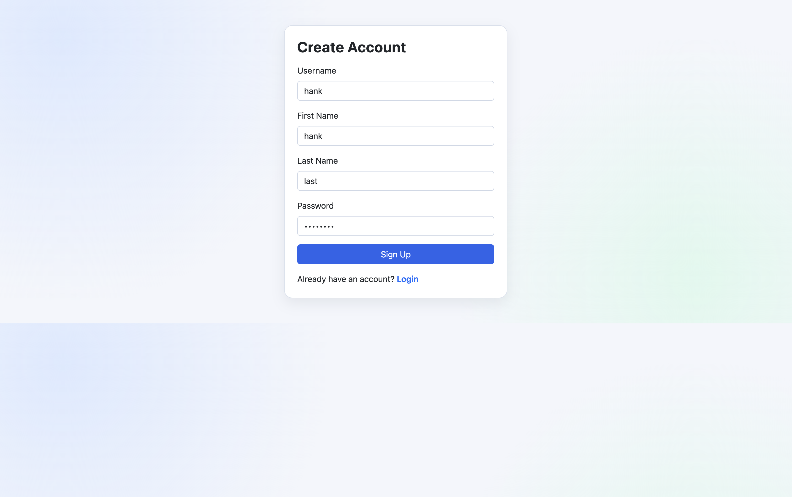
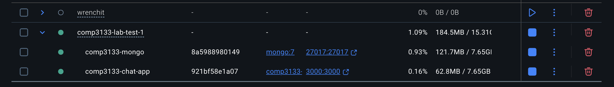
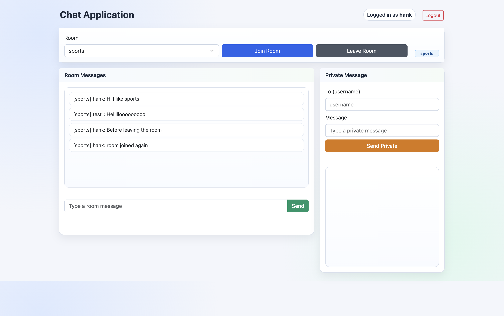
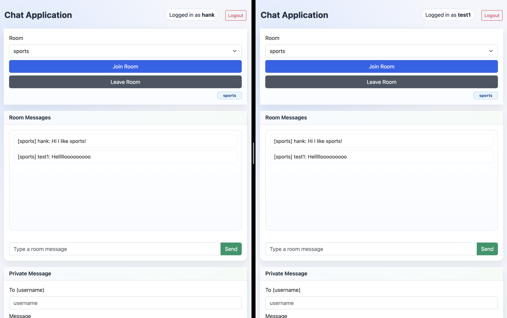

# COMP3133 Lab Test 1 Chat Application

This is a real time chat app built with Express, Socket.io, MongoDB (Mongoose), and Docker with signup/login and room based messaging.  

It supports group chat, private messages, and has persistent room message storage. It's simply built and even easier to run thanks to Docker! 

## Run

```bash
docker compose up --build
```

Open: `http://localhost:3000/view/login.html`

## Features

### Signup

You are able to create a new user account and it stores the user profile in MongoDB with unique username validation.

### Login

This app authenticates existing users and starts the chat session using localStorage.

### Main Chat Page

This is the app layout with its main feature of persistent chatrooms. 

### Dual-Screen Room Conversation

Demonstrating real-time room chat between two users with synchronized messages across both screens.
